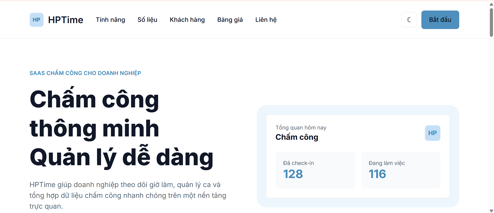
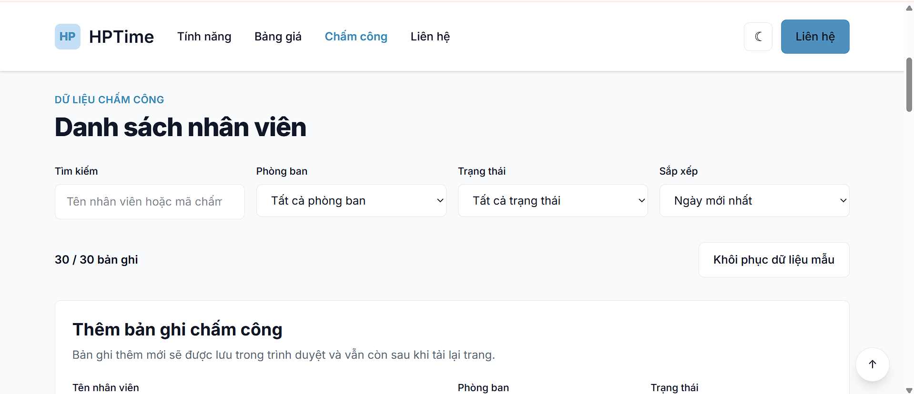
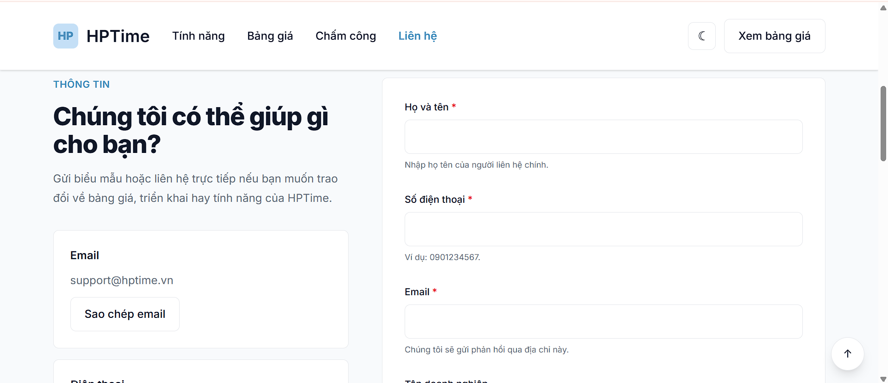

# HPTime - SaaS chấm công thông minh

## Thực hành Thiết kế Web

### Sinh viên thực hiện

**Họ tên:** Lê Hữu Phúc

**Sản phẩm:** HPTime - SaaS chấm công thông minh

---

## Demo

**Website:**  
https://phuc201205.github.io/TKW_2354050099_Phuc/

**Figma:**  
https://www.figma.com/design/75ddYYpn0x33POxewcXaVE/Landwind---Tailwind-CSS-Landing-Page--Community-?node-id=1-19856&p=f&t=qFOWOFFlkPROeGTu-0

---

# Giới thiệu

HPTime là website SaaS hỗ trợ doanh nghiệp quản lý chấm công, theo dõi thời gian làm việc, phòng ban và thông tin liên quan đến nhân viên.

Website được xây dựng xuyên suốt các buổi thực hành môn Thiết kế Web và được phát triển dần từ giao diện tĩnh thành một website responsive có Dark Mode, JavaScript tương tác, dữ liệu động và kiểm tra biểu mẫu.

---

# Ảnh chụp giao diện

## Trang chủ



## Trang chấm công



## Trang liên hệ



---

# Công nghệ sử dụng

- HTML5
- Tailwind CSS v4
- JavaScript ES Modules
- Fetch API
- LocalStorage
- Constraint Validation API
- IntersectionObserver
- Intl.NumberFormat
- Git
- GitHub
- GitHub Pages

Website không sử dụng thư viện JavaScript bên ngoài cho các chức năng tương tác.

---

# Các trang chính

## `index.html`

Trang chủ giới thiệu sản phẩm HPTime, các tính năng, số liệu, cảm nhận khách hàng, bảng giá và FAQ.

## `pricing.html`

Trang bảng giá với các gói Starter, Business và Enterprise.

Người dùng có thể chuyển đổi giữa giá theo tháng và giá theo năm.

## `contact.html`

Trang liên hệ với biểu mẫu tư vấn.

Form được kiểm tra dữ liệu bằng Constraint Validation API và hiển thị thông báo lỗi bằng tiếng Việt.

## `attendance.html`

Trang quản lý dữ liệu chấm công.

Dữ liệu ban đầu được tải từ:

```text
data/records.json
```

sau đó được quản lý thông qua JavaScript theo mô hình:

```text
state
  ↓
render()
  ↓
DOM
```

---

# Các tính năng đã hoàn thành

## Responsive

Website được xây dựng theo hướng mobile-first và hỗ trợ các kích thước màn hình từ điện thoại đến desktop.

---

## Dark Mode

Dark Mode sử dụng design token trong Tailwind CSS.

Lựa chọn của người dùng được lưu bằng:

```javascript
localStorage
```

Nếu người dùng chưa chọn chế độ sáng hoặc tối, website sử dụng:

```css
prefers-color-scheme
```

để lấy thiết lập của hệ điều hành.

---

## Menu mobile

Menu mobile hỗ trợ:

- Mở và đóng bằng nút menu.
- Thuộc tính `aria-expanded`.
- Đóng bằng phím `Escape`.
- Đóng khi click ra ngoài.
- Trả focus về nút menu sau khi đóng bằng ESC.

---

## Navbar khi cuộn trang

Navbar sử dụng:

```javascript
IntersectionObserver
```

để thay đổi trạng thái khi người dùng bắt đầu cuộn trang.

---

## Accordion FAQ

FAQ sử dụng Event Delegation.

Tại một thời điểm chỉ có một câu hỏi được mở.

---

## Công tắc giá tháng / năm

Trang bảng giá sử dụng:

```javascript
Intl.NumberFormat("vi-VN")
```

để định dạng tiền Việt Nam.

Người dùng có thể chuyển đổi giữa:

```text
Theo tháng
Theo năm
```

---

## Slider cảm nhận khách hàng

Slider được viết bằng JavaScript thuần.

Các chức năng gồm:

- Nút Previous / Next.
- Dot navigation.
- Tự động chuyển slide.
- Dừng autoplay khi hover hoặc focus.
- Hỗ trợ bàn phím.
- Hỗ trợ `prefers-reduced-motion`.
- Slide không hiển thị sử dụng `inert`.

---

## Reveal Animation

Các section sử dụng:

```javascript
IntersectionObserver
```

để xuất hiện khi đi vào viewport.

Nếu người dùng bật:

```css
prefers-reduced-motion: reduce
```

animation sẽ được tắt.

---

## Sao chép email

Trang liên hệ có chức năng sao chép nhanh địa chỉ:

```text
support@hptime.vn
```

Sau khi sao chép, hệ thống sử dụng:

```html
role="status"
aria-live="polite"
```

để thông báo kết quả.

---

# Quản lý dữ liệu chấm công

Trang `attendance.html` là trang dữ liệu động của HPTime.

## Tải dữ liệu bằng Fetch API

Dữ liệu mẫu được lưu tại:

```text
data/records.json
```

JavaScript sử dụng:

```javascript
fetch()
```

và:

```javascript
async / await
```

để tải dữ liệu.

Hệ thống kiểm tra:

```javascript
response.ok
```

trước khi đọc JSON.

---

## Các trạng thái giao diện

Trang dữ liệu hỗ trợ đầy đủ:

- Loading.
- Có dữ liệu.
- Không có dữ liệu.
- Lỗi tải dữ liệu.

---

## Tìm kiếm

Người dùng có thể tìm theo:

- Tên nhân viên.
- Mã chấm công.

Tìm kiếm sử dụng debounce khoảng:

```text
300 ms
```

để tránh xử lý liên tục sau mỗi lần gõ phím.

---

## Lọc dữ liệu

Có thể lọc theo phòng ban:

- Nhân sự.
- Kinh doanh.
- Kế toán.
- Kỹ thuật.
- Vận hành.

Có thể lọc theo trạng thái:

- Đúng giờ.
- Đi trễ.
- Nghỉ phép.

Các điều kiện tìm kiếm và lọc có thể hoạt động đồng thời.

---

## Sắp xếp

Dữ liệu có thể sắp xếp theo:

- Ngày mới nhất.
- Ngày cũ nhất.
- Tổng giờ cao đến thấp.
- Tổng giờ thấp đến cao.
- Tên nhân viên A đến Z.

---

## Thêm và xóa bản ghi

Người dùng có thể:

- Thêm bản ghi chấm công.
- Xóa bản ghi.
- Khôi phục dữ liệu mẫu.

Dữ liệu sau khi thay đổi được lưu trong:

```javascript
localStorage
```

nên vẫn tồn tại sau khi tải lại trang.

---

## An toàn khi render dữ liệu

Website không nối trực tiếp dữ liệu người dùng vào:

```javascript
innerHTML
```

Các dòng trong bảng được tạo bằng:

```html
<template>
```

và dữ liệu được đưa vào DOM bằng:

```javascript
textContent
```

để hạn chế nguy cơ XSS.

---

# Validation biểu mẫu

Form liên hệ sử dụng:

```html
novalidate
```

để tắt giao diện thông báo mặc định của trình duyệt nhưng vẫn giữ Constraint Validation API.

JavaScript sử dụng các thuộc tính:

```javascript
field.validity
field.checkValidity()
```

để xác định lỗi.

Các lỗi được hiển thị bằng tiếng Việt.

Ví dụ:

```text
Email chưa đúng dạng.
Nhập 10 chữ số, bắt đầu bằng 0.
Nội dung cần ít nhất 20 ký tự.
```

Khi một trường không hợp lệ, hệ thống thêm:

```html
aria-invalid="true"
```

Nếu submit có nhiều lỗi:

1. Tất cả trường sai được đánh dấu.
2. Có thông báo tổng hợp số lỗi.
3. Focus được chuyển đến trường sai đầu tiên.

Khi gửi thành công, website hiển thị thông báo bằng `aria-live`.

---

# Accessibility

Website được cải thiện khả năng truy cập bằng:

- Semantic HTML.
- `label` thật cho form.
- `aria-expanded`.
- `aria-current`.
- `aria-live`.
- `aria-invalid`.
- `role="status"`.
- `role="alert"`.
- Skip link.
- Focus visible cho thành phần tương tác.
- Điều khiển bằng bàn phím.
- `prefers-reduced-motion`.
- Caption cho bảng dữ liệu.
- Vùng bảng có thể focus khi cần cuộn ngang.

---

# Cấu trúc project

```text
TKW_2354050099_Phuc/
│
├── index.html
├── pricing.html
├── contact.html
├── attendance.html
│
├── assets/
│   └── screenshots/
│       ├── home.png
│       ├── attendance.png
│       └── contact.png
│
├── data/
│   └── records.json
│
├── src/
│   └── input.css
│
├── dist/
│   └── output.css
│
├── js/
│   ├── main.js
│   ├── nav.js
│   ├── theme.js
│   ├── faq.js
│   ├── pricing.js
│   ├── slider.js
│   ├── reveal.js
│   ├── extra.js
│   ├── attendance.js
│   └── validation.js
│
├── package.json
├── package-lock.json
└── README.md
```

---

# Hướng dẫn chạy project

## Bước 1 - Clone repository

```bash
git clone https://github.com/Phuc201205/TKW_2354050099_Phuc.git
```

Di chuyển vào thư mục:

```bash
cd TKW_2354050099_Phuc
```

## Bước 2 - Cài dependency

```bash
npm install
```

## Bước 3 - Build Tailwind CSS

```bash
npm run build
```

## Bước 4 - Chạy website

```bash
npx serve .
```

Sau đó mở:

```text
http://localhost:3000
```

Trang chấm công:

```text
http://localhost:3000/attendance.html
```

---

# Git workflow

Project được phát triển theo từng branch thực hành:

```text
buoi-1
buoi-2
buoi-3
buoi-4
buoi-5
```

Các phiên bản hoàn thành được đánh dấu bằng Git tag tương ứng.

---

# 3 điều tôi sẽ làm lại nếu có thêm thời gian

## 1. Component hóa Header và Footer tốt hơn

Hiện Header và Footer vẫn được lặp lại trong nhiều file HTML.

Nếu làm lại, tôi sẽ tổ chức chúng thành các component hoặc template dùng chung để giảm code trùng lặp và tránh việc phải sửa cùng một nội dung ở nhiều trang.

## 2. Thiết kế và chuẩn hóa dữ liệu chấm công ngay từ đầu

Phần dữ liệu động được bổ sung ở giai đoạn cuối của project.

Nếu làm lại, tôi sẽ xác định trước cấu trúc dữ liệu nhân viên và chấm công để giao diện, bộ lọc và JavaScript được thiết kế thống nhất ngay từ đầu.

## 3. Xây dựng backend và cơ sở dữ liệu thật

Hiện dữ liệu của project được mô phỏng bằng JSON và lưu thay đổi bằng `localStorage`.

Nếu có thêm thời gian, tôi sẽ xây dựng API và cơ sở dữ liệu để dữ liệu chấm công có thể lưu trên server, hỗ trợ nhiều tài khoản và gần với một hệ thống SaaS thực tế hơn.

---

# Kết luận

Qua project HPTime, tôi đã thực hành quá trình xây dựng một website từ giao diện responsive cơ bản đến một ứng dụng front-end có tương tác, dữ liệu động, lưu trạng thái và accessibility.

Project giúp tôi hiểu rõ hơn mối liên hệ giữa:

```text
HTML
+
Tailwind CSS
+
JavaScript
+
State
+
DOM
```

và cách tổ chức một website hoàn chỉnh trước khi phát hành.